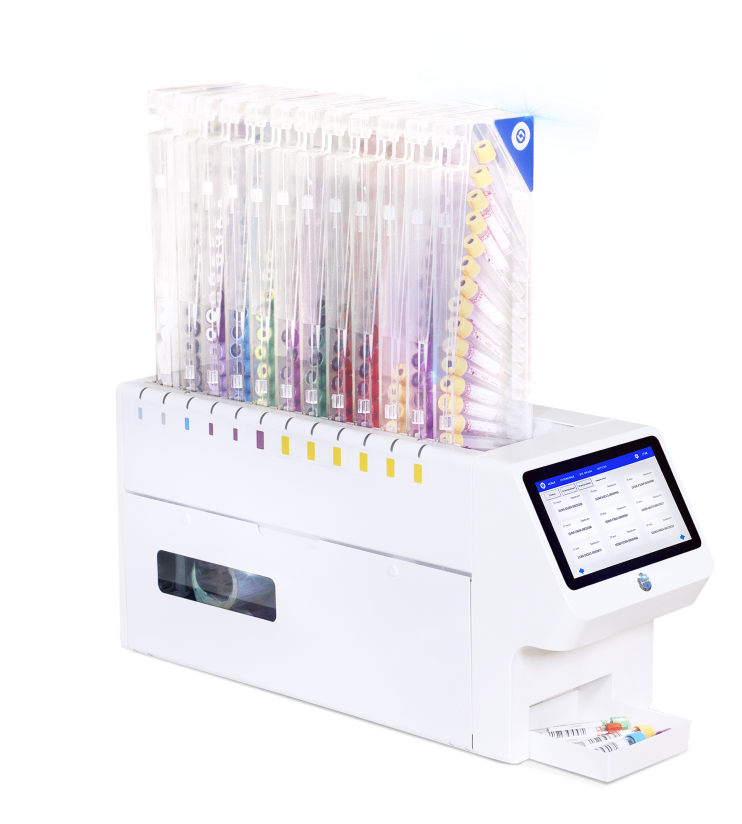

# About

The Labbeller is a device that simplifies and automates probe marking.

## My role in project

I joined the project at the UI and backend change stage as QA.
There was never a tester on the project, there were no requirements, there was no testing process.

The main part of user interface should have remained unchanged.

While new vershion of aplication was developing I desighned diagrams of state and transactions for each application screen.
Studied the structure of the device in detail. identified a list of key requirements and critically important functions.

